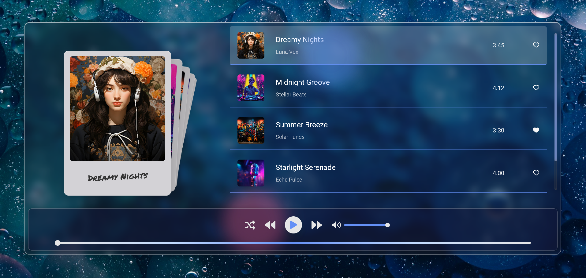

# Music Player

A sleek and interactive music player built with React and Swiper.js, featuring a card-stack interface and playlist controls.

Demo [Music Player](https://yourfavmusic-player.vercel.app/).

## Features

In the project directory, you can run:

- Card-Stack Display: Browse songs with a visually appealing card effect using Swiper's `EffectCards`.
- Playlist Management: View song details, toggle favorites, and switch between tracks.
- Audio Controls: Play/pause, shuffle, skip tracks, adjust volume, and mute/unmute.
- Progress Bar: Track and control song playback progress.
- Responsive Design: Smooth scrolling and active song highlighting.

### Tech Stack

- React: Frontend library for building the UI.
- Swiper.js: Handles the card-stack carousel effect.
- CSS: Custom styles in `MusicPlayer.css` for layout and animations.

